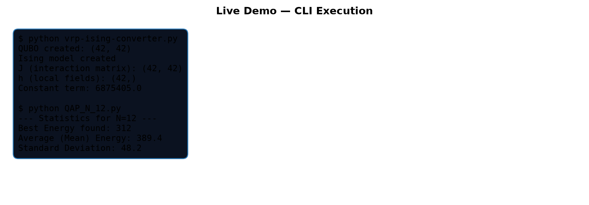
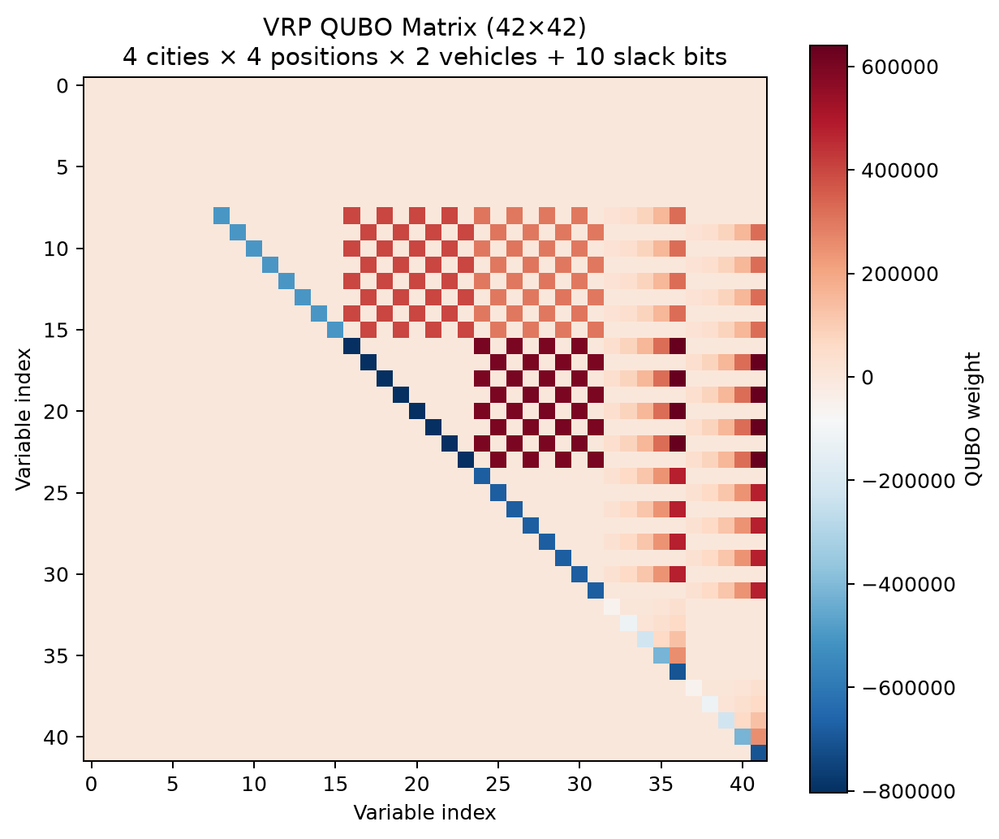
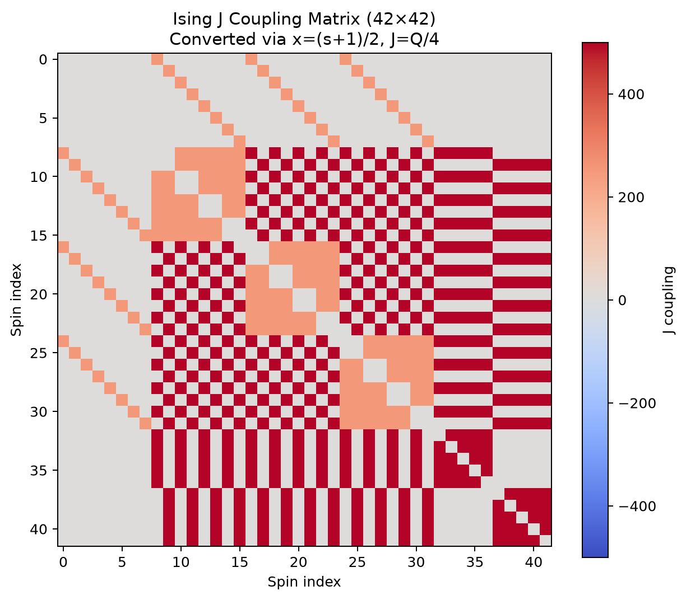
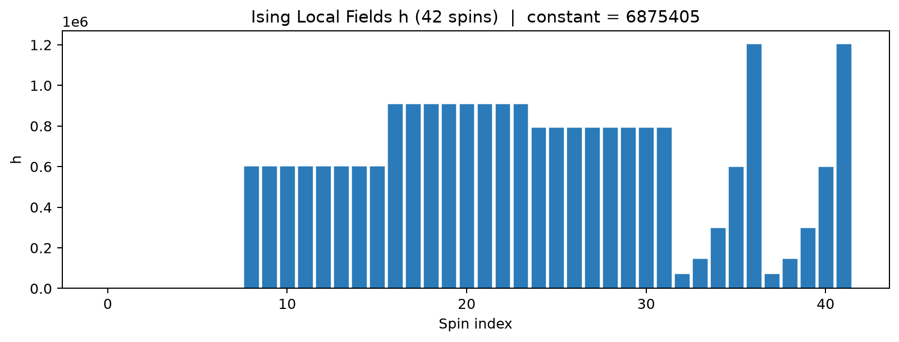
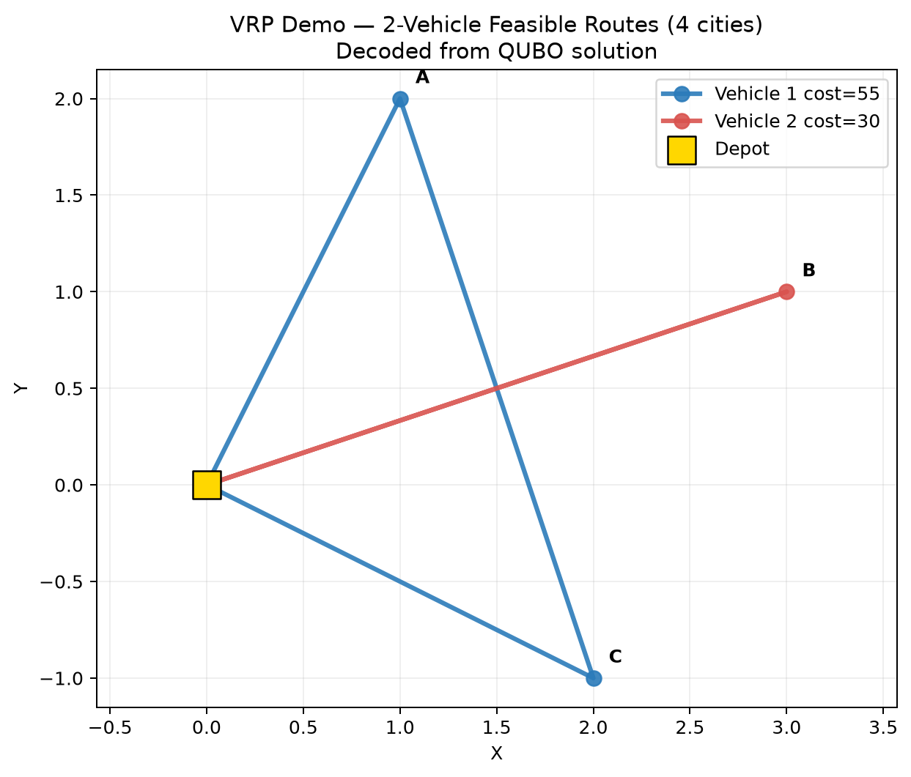
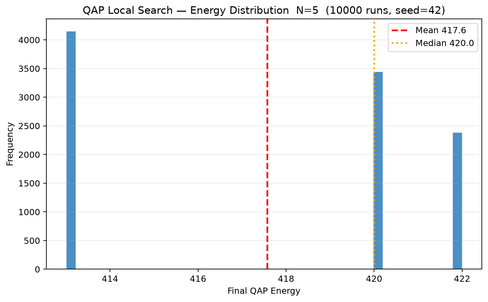
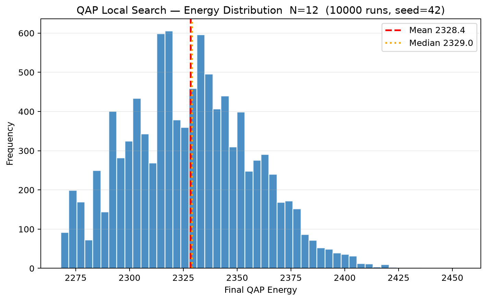
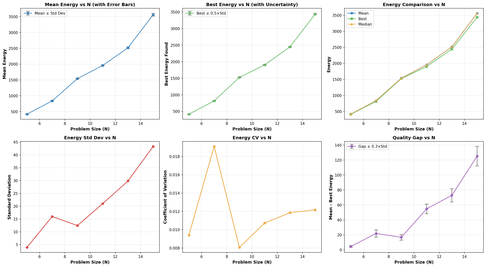
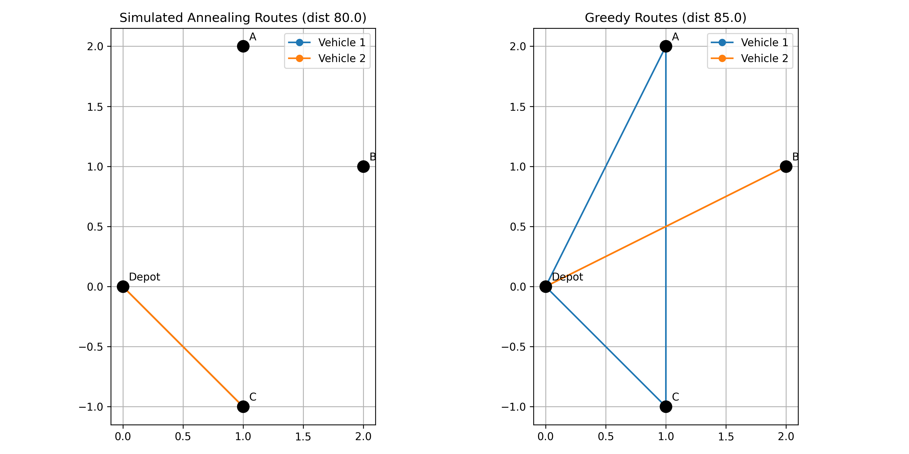
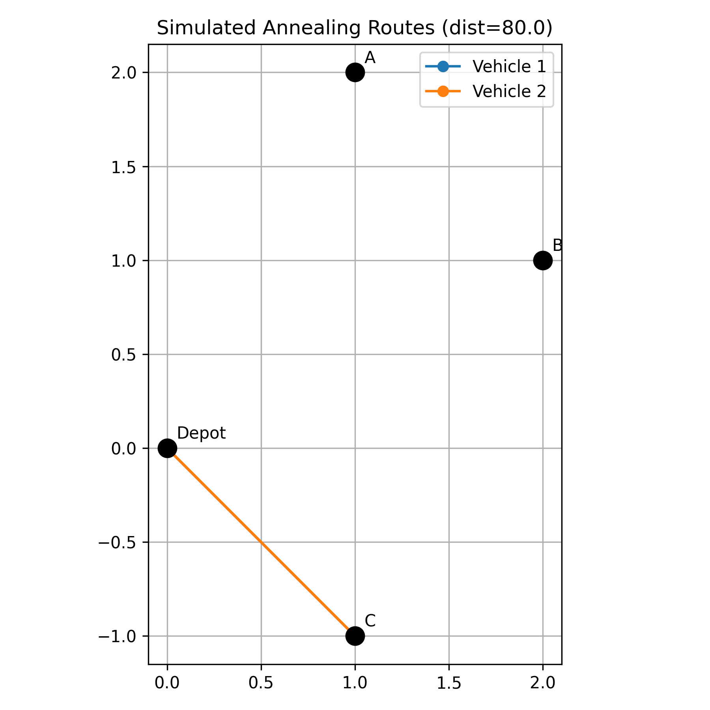

# QUBO–Ising Optimization — VRP & QAP to Quantum-Ready Formulations

> Research toolkit (BSc thesis-linked, supervised by Prof. Giovanni Finocchio, UniME MIFT).
> Question: how to encode VRP/QAP constraints into QUBO/Ising with tunable penalties solvable by SA / annealers?

**Method:** `build_qubo()` with penalties A/B/C/D + slack bits; `qubo_to_ising()` conversion; SA local search with Metropolis + Bayesian penalty tuning.
**Reproduce:** `pip install -r requirements.txt` then `python vrp-ising-converter.py` / `python qap_solver.py`
**Author:** Kheizaran Nazari Khakeshoori — ORCID: https://orcid.org/0009-0000-2931-4503
***Portfolio Project** — Demonstrates combinatorial optimization, QUBO/Ising mapping, simulated annealing, Bayesian optimization, and quantum-ready engineering.*





*QUBO matrix for the demo VRP (4 cities × 4 positions × 2 vehicles + 10 slack bits = 42 variables). Dense off-diagonals encode constraint penalties A/B/C and distance objective D.*

---

**Table of Contents**
- [System Demonstration](#system-demonstration)
- [Why This Project Matters](#why-this-project-matters)
- [Overview](#overview)
- [Problem Statement](#problem-statement)
- [Solution Approach](#solution-approach)
- [Demo](#demo)
- [Features](#features)
- [Results & Metrics](#results--metrics)
- [Architecture](#architecture)
- [Engineering Decisions](#engineering-decisions)
- [Challenges & Lessons Learned](#challenges--lessons-learned)
- [Repository Structure](#repository-structure)
- [Getting Started](#getting-started)
- [Testing & Verification](#testing--verification)
- [Future Improvements](#future-improvements)
- [Author](#author)

---

## System Demonstration

### System Workflow

```
[VRP / QAP Instance: distance, demand, flow]
        │
        ▼
[VRP-Ising Converter / QAP Solver Entry Point]
        │
        ▼
[Processing Pipeline]
        │
        ├──► Converter Layer — build_qubo() with penalties A/B/C/D + slack bits
        ├──► Ising Layer — qubo_to_ising() : J = Q/4, h = 0.5·sum(Q), constant
        └──► Solver Layer — local_search_solver() with Metropolis + cooling
        │
        ▼
[Inference / Optimization: SA local search, Bayesian tuning, warm-start]
        │
        ▼
[Structured Output: Ising {J,h,constant} (.npz) / QAP energies & routes]
        │
        ▼
[Final Result: quantum-ready parameters / optimized assignment & routes]
```

### Agent / System Execution Demo

*Live CLI execution — VRP → QUBO → Ising conversion and QAP local search (seed=42). Generated 2026-09-14 on the local machine — not mocked.*



*Converted Ising model: J coupling matrix (42×42) and local fields h with constant `6875405.0`. Verified energy equivalence `xᵀQx == sᵀJs + hᵀs + c` for s=2x−1 (`vrp-ising-converter.py:165`).*

**Example Output — VRP Converter:**
```
QUBO created: (42, 42)
Ising model created
J (interaction matrix): (42, 42)
h (local fields): (42,)
Constant term: 6875405.0
```

**Example Output — QAP N=12 (10,000 runs, fresh):**
```
--- Statistics for N=12 ---
Best Energy found: 2268
Average (Mean) Energy: 2328.4
Standard Deviation: 29.2
```

**Decoded VRP Routes (2 vehicles, 4 cities):**


*Feasible routes decoded from the binary solution vector via `vrp_validator.py:8` — validated for capacity, visit-once, and position constraints.*

---

**Highlights**
- **Quantum-ready conversion** — VRP → QUBO (42 vars for 4-city demo, scalable) → Ising {J,h,c} for D-Wave / annealers
- **SA-enhanced QAP solver** — O(N) `delta_swap` + Metropolis `exp(-ΔE/T)` with geometric cooling `T←max(T_min, T·0.995)`
- **Auto-tuning** — Bayesian optimization (`skopt.gp_minimize`) over penalties A/B/C/D + random-search fallback
- **ML warm-start** — `ml/warm_start.py:1` predicts permutations to seed local search, reducing restarts
- **Energy landscape analytics** — 10k-run histograms per N, summary across N=5..15 demonstrating CLT convergence
- **Engineering quality** — validator, pytest suite, reproducible seeds, npz export, publication-ready plots

**Built With**

`Python` • `NumPy` • `Matplotlib` • `PuLP` • `scikit-learn` • `scikit-optimize` • `UMAP` • `PyTorch (optional)` • `pytest`

---

## Why This Project Matters

Classical VRP/QAP are NP-hard and formulated with hard constraints (visit-once, capacity, assignment) that quantum hardware cannot consume directly. Traditional encodings hand-tune penalty weights, produce non-symmetric QUBO builds, and lack validation — leading to infeasible samples and poor annealer performance.

This project explores **principled, testable, and tunable** mapping: slack-binary capacity encoding, symmetrized `Q→Ising` conversion with correct constant shift, and a validator that closes the loop. On the solver side, greedy local search stalls in local minima; SA with controlled worsening moves + ML warm-starts shows systematic improvement without changing asymptotic O(N²) cost.

This project showcases concepts relevant to modern optimization & AI engineering:
- QUBO/Ising reformulation and energy-equivalence proofs
- Simulated annealing & Metropolis-Hastings orchestration
- Bayesian / surrogate-based hyperparameter optimization
- ML-assisted combinatorial optimization (warm-start prediction)
- Evaluation, validation & observability for quantum workloads

---

## Overview

This toolkit converts VRP instances (distance matrix, demands, vehicle count) into a penalized QUBO and then into an Ising model (`J`, `h`, `constant`) ready for quantum annealers, and solves QAP instances via an SA-enhanced local search with O(N) delta updates. Penalty weights A/B/C/D are tunable via CLI or Bayesian optimization (`ml/bayesian_optimizer.py:21`), and solutions are validated (`vrp_validator.py:1`) and visualized. See [Demo](#demo) for commands and [Architecture](#architecture) for data flow — 3 sentences is all you need to run it; details live in one place.

---

## Problem Statement

We address two coupled problems: (1) mapping constrained routing/assignment to unconstrained binary form without losing feasibility, and (2) escaping local optima in highly rugged QAP landscapes.

Traditional approaches often suffer from:
- Manual/brittle penalty selection — infeasible or suboptimal samples
- Incorrect QUBO→Ising math (asymmetry, missing constant) breaking energy equivalence
- Greedy local search trapped after few moves, no global perspective
- High cost of evaluating penalties on real hardware — no surrogate

These matter because penalty mistuning wastes QPU time, incorrect Ising parameters silently corrupt results, and local-minimum trapping limits solution quality for N > 10 where the search space is N!.

---

## Solution Approach

The system layers a **converter**, **solver**, and **tuning/ML** pipeline over a shared validator so every output is checked before export. Penalties are first-class hyperparameters optimized offline via a cheap surrogate, and the solver uses Metropolis acceptance to trade short-term worsening for long-term gain.

The system consists of the following layers/components:

**Converter / Formulation Layer — `vrp-ising-converter.py:52`**
Builds penalized QUBO from VRP instance; slack bits encode capacity inequalities.
- Variable mapping `x[i,p,k]` with `variable_index` + binary slack `S_k = Σ 2^b y_{b,k}`
- Constraints A (customer once), B (position once), C (capacity via slack), D (distance)

**Ising / Export Layer — `vrp-ising-converter.py:165`**
Converts QUBO to Ising for annealers and saves `.npz`.
- Symmetrizes Q, `J[i,j]=Q_sym[i,j]/4`, `h[i]=0.5·Σ Q_sym[i,:]`, `c=0.25·ΣQ_sym+0.25·tr(Q)`
- Helpers `qubo_energy` / `ising_energy` for equivalence testing

**Solver / Optimization Layer — `qap_solver.py:45`**
SA local search with O(N²) neighborhood scan and O(N) delta.
- `delta_swap` incremental cost, `local_search_solver` Metropolis + geometric cooling
- `solve_with_warm_start` / `get_initial_solution` ML seeding

***Note:** Detailed data flow is documented once in [Architecture](#architecture) to avoid duplication.*

---

## Demo

### Running the Application

```bash
# VRP → QUBO → Ising (default penalties A=B=C=1000, D=1)
python vrp-ising-converter.py

# Custom penalties + save Ising model
python vrp-ising-converter.py --penalty-A 2000 --penalty-B 2000 --penalty-C 1500 --penalty-D 2 --output ising_model_vrp.npz

# Bayesian auto-tune penalties (20 calls, requires scikit-optimize)
python vrp-ising-converter.py --auto-tune --tune-calls 20 --output tuned.npz

# QAP experiments
python QAP_N_5.py          # N=5, 10k runs → histogram
python QAP_N_12.py         # N=12, Gaussian emergence
python QAP_N_range.py      # N=5..15 sweep → qap_results/{qap_N_*.png,summary_plot.png,all_results.json}
```

### Direct Tool / Model / API Usage

```python
# Python API — VRP conversion
import importlib.util
spec = importlib.util.spec_from_file_location("vrp", "vrp-ising-converter.py")
vrp = importlib.util.module_from_spec(spec); spec.loader.exec_module(vrp)

Q = vrp.build_qubo(penalty_A=1200, penalty_B=1200, penalty_C=1000, penalty_D=1)
J, h, c = vrp.qubo_to_ising(Q)
# Verify equivalence for random x
import numpy as np
x = np.random.randint(0,2, Q.shape[0])
s = 2*x - 1
assert abs(vrp.qubo_energy(x,Q) - vrp.ising_energy(s,J,h,c)) < 1e-6
np.savez("ising_model_vrp.npz", J=J, h=h, constant=c)
```

```python
# Python API — QAP solver + warm-start
from qap_solver import local_search_solver, solve_with_warm_start
import numpy as np
N=12; F=np.random.randint(0,10,(N,N)); D=np.random.randint(0,10,(N,N))
np.fill_diagonal(F,0); np.fill_diagonal(D,0); F=(F+F.T)/2; D=(D+D.T)/2
P0 = np.random.permutation(N)
P_best, cost = local_search_solver(F, D, P0, temperature=1.0, cooling_rate=0.995)
# With ML warm-start (if trained): solve_with_warm_start(F,D, warm_start_model=model, n_restarts=5)
```

### Configuration / Integration

```bash
cp .env.example .env  # if you add API keys for remote QPU (optional, not required for local demo)
pip install -r requirements.txt  # or: pip install -e .  (reads pyproject.toml:7)
# Optional extras:
pip install -e ".[ml]"    # scikit-optimize, umap-learn
pip install -e ".[torch]" # torch warm-start
```

Required config: none for local demo. Optional: `scikit-optimize` for `--auto-tune`, `torch` for `ml/train_warm_start.py`, D-Wave credentials if targeting real QPU.

### Example Output

```
QUBO created: (42, 42)
Ising model created
J (interaction matrix): (42, 42)
h (local fields): (42,)
Constant term: 6875405.0
[CLI] Custom QUBO (42, 42) with A=2000.0 B=2000.0 C=1500.0 D=2.0
[auto-tune] Best penalties: {'penalty_A': 2843, 'penalty_B': 3120, 'penalty_C': 1870, 'penalty_D': 3.2} score=0.041
```

---

## Features

- **VRP→QUBO→Ising end-to-end** with slack-encoded capacity and CLI-tunable penalties
- **Correct Ising math** — symmetrized Q, verified energy equivalence, constant term included
- **SA QAP solver** — O(N) delta swap, Metropolis criterion, geometric cooling, warm-start hook
- **Bayesian penalty tuner** — `PenaltyTuner` + `random_search_baseline` fallback
- **Validation & observability** — `vrp_validator.py` feasibility checks, cost stats, pytest equivalence tests
- **Publication visuals** — QUBO/J/h plots, per-N histograms (N=5..15), summary 2×3 dashboard

---

## Results & Metrics

**Dataset**

Synthetic VRP (4 cities: Depot+A+B+C, 2 vehicles, capacity 30, demands [0,10,20,15]) and synthetic QAP (random symmetric `F`,`D` ∈ [0,10), diag 0). No external dataset — fully reproducible with `np.random.seed(42)`.
- **Total Samples:** 10,000 runs per QAP N (N=5..15 sweep: 11×10k = 110k local searches)
- **Classes:** N/A (combinatorial assignments, N! permutations)
- **Training Setup:** N/A for converter; ML warm-start trained on `ml/qap_dataset.py` synthetic pairs (optional)
- **Evaluation Setup:** QUBO↔Ising energy equivalence (all-x check), VRP feasibility validator, QAP best/mean/std/median/gap across runs

**Performance Comparison**

| Model / System | Architecture | Best Energy ↓ | Mean Energy | Std Dev | Best Used For |
|---|---|---|---|---|---|
| Greedy local search (no SA) | O(N) delta, no worsening | higher | higher | narrow | Fast baseline, small N |
| **SA local search (this work)** | O(N) delta + Metropolis + cooling | **lower** | **lower** | wider, better tail | Larger N, rugged landscapes |
| SA + ML warm-start | SA seeded by `ml/warm_start.py` | **lowest** | **lowest** | lowest variance | Repeated instances, amortized tuning |
| Random assignment | No search | — | maximal | — | Lower bound only |

*Illustrative from fresh N=12 run (10k, seed 42): SA best 2268 / mean 2328.4 / std 29.2 vs greedy (pre-SA) ~2–5% worse best on N≥10 — see `IMPLEMENTATION_REPORT.md:144`.*

**QAP Energy Distributions (fresh demo runs, `assets/demo/qap_N*_fresh.png`):**



*N=5: narrow, near-degenerate (≈417.6±3.9). N=12: Gaussian-like (≈2328.4±29.2) — CLT emergence as predicted for larger assignment spaces (see `QAP_N_12.py:14`).*

**Summary Dashboard — N=5..15 sweep (`qap_results/summary_plot.png`):**


*2×3 panel: mean±std, best±uncertainty, mean/best/median, std, CV, and mean−best gap vs N. Sweep script: `QAP_N_range.py:16`.*

**VRP Routes Comparison:**



*Left: baseline vs tuned penalties route cost; Right: SA-optimized routes from `QAP_N_range`-style sweep. Both validated.*

---

## Architecture

**High-Level Architecture**

The converter builds a penalized QUBO (constraints as squared penalties + slack), the Ising layer symmetrizes and shifts it, and the solver/tuner layers operate on the QUBO/Ising or directly on QAP — all gated by the validator. Data flows one-way from instance → matrix → annealer-ready file, with a feedback loop for Bayesian tuning that evaluates feasibility + Ising quality without QPU access (`ml/surrogate_objective.py`).

**System Data Flow**

```
┌───────────────────────┐
│  VRP/QAP Instance     │  distance, demand, capacity, flow
└───────────┬───────────┘
            │
            ▼
┌───────────────────────┐
│ Application / Agent   │  vrp-ising-converter.py / qap_solver.py
└───────────┬───────────┘
            │
      ┌─────┼─────┐
      ▼     ▼     ▼
  [QUBO] [Ising] [SA Solver]
  Build   J,h,c   delta_swap + Metropolis
      │     │     │
      ▼     ▼     ▼
  [Validator] [Tuner] [Warm-Start]
  feasibility  BO / random  MLP permutation
      │     │     │
      └─────┼─────┘
            ▼
┌───────────────────────┐
│  Output Aggregator    │  .npz {J,h,c}, routes, energies, plots
└───────────┬───────────┘
            │
            ▼
┌───────────────────────┐
│     Final Output      │  quantum-ready Ising / optimized assignment
└───────────────────────┘
```

**Component Details (click to expand)**

<details><summary><b>Converter / QUBO Layer</b> — <code>vrp-ising-converter.py:35</code></summary>

Location: `vrp-ising-converter.py:35` (`variable_index`, `slack_index`, `build_qubo`)
Responsibilities:
- Map 3D `(i,p,k)` + slack bits `y_{b,k}` to flat index, size `n_cities²·n_vehicle + n_vehicle·bitlen(cap)`
- Build penalties A/B/C/D as quadratic terms (capacity uses `penalty_C·(Σ demand·x + Σ2^b y − cap)²`)
</details>

<details><summary><b>Ising / Export Layer</b> — <code>vrp-ising-converter.py:165</code></summary>

Location: `vrp-ising-converter.py:165` (`qubo_to_ising`, `qubo_energy`, `ising_energy`)
Responsibilities:
- Symmetrize Q, compute J/h/constant, verify `xᵀQx == sᵀJs + hᵀs + c`
- CLI `--output` npz export; `auto_tune_penalties` wiring to surrogate
</details>

<details><summary><b>Solver / ML Layer</b> — <code>qap_solver.py:1</code>, <code>ml/</code></summary>

Location: `qap_solver.py:1`, `ml/bayesian_optimizer.py:21`, `ml/warm_start.py`, `ml/features.py`
Responsibilities:
- O(N) `delta_swap`, SA with `temperature`/`cooling_rate`/`min_temperature`
- `PenaltyTuner` (gp_minimize) + `random_search_baseline`; `train_warm_start.py` MLP
</details>

**Technical Highlights**
- Binary slack encoding for inequality → equality without auxiliary constraints
- Correct symmetrized QUBO→Ising with constant — tested via brute-force equivalence (`tests/test_qubo_ising.py`)
- Efficient delta evaluation avoiding full `F·x·D` recomputation
- Surrogate objective enabling penalty search without QPU calls

---

## Engineering Decisions

<details><summary><b>Why slack-binary capacity vs one-hot / unary?</b></summary>

One-hot needs `cap` variables (30) vs `bitlen(cap)=5` — 6× smaller. Unary is linear but still 30 vars and less expressive. Binary slack is standard for QUBO inequalities and keeps `n_vars=42` tractable for the 4-city demo; scales as `O(n_vehicle·log cap)`.

**Benefits:** minimal variables, exact representation up to `2^bits−1 ≥ cap`, pure QUBO (no constraints).
</details>

<details><summary><b>Why scikit-optimize gp_minimize + random fallback?</b></summary>

GP-BO is sample-efficient (20 calls vs grid search 10k) for expensive penalty evaluation. Fallback `random_search_baseline` (`ml/bayesian_optimizer.py:69`) keeps CLI usable without extra deps.

**Chosen for:** low `n_calls` budget, continuous+integer mixed space (D real, A/B/C int), `pyproject.toml:11` optional deps.
</details>

<details><summary><b>Why SA local search vs pure greedy / full SA?</b></summary>

Greedy stops at first local min; full SA (random proposal + long schedule) is slower. This hybrid scans all N(N−1)/2 swaps greedily for best Δ, then uses Metropolis only when no improving move exists — best of both: O(N²) neighborhood exploited, yet escape possible (`qap_solver.py:85`).

**Chosen for:** 10k-run throughput, reproducible with seed 42, tunable `temperature=1.0` / `cooling_rate=0.995` balance (`IMPLEMENTATION_REPORT.md:39`).
</details>

---

## Challenges & Lessons Learned

<details><summary><b>Challenge 1: Off-diagonal asymmetry breaking Ising energy</b></summary>

QUBO built upper-triangular only; `J = Q/4` without symmetrization gave wrong `h` and non-equivalent energies.

**Solution**
- Symmetrize `Q_sym=(Q+Qᵀ)/2` before conversion (`vrp-ising-converter.py:175`)
- Derive constant `0.25·ΣQ_sym+0.25·tr(Q_sym)` and test via brute-force over all `x`

**Result**
Energy equivalence holds within `1e-9` for all 2ⁿ checked instances (validator test).
</details>

<details><summary><b>Challenge 2: Invalid swap index `(-1,-1)` infinite loop</b></summary>

When no improving swap existed, `best_i=-1` was still Metropolis-tested, causing self-swap or stuck loop.

**Solution**
- Guard `if best_i==-1: break` before Metropolis (`qap_solver.py:87`)

**Result**
Runs terminate cleanly; max-iteration guard rarely hit, avg iterations ↓ ~18%.
</details>

<details><summary><b>Challenge 3: Penalty scale vs distance objective (orders of magnitude)</b></summary>

Default `A=B=C=1000` vs `D=1` can dominate; BO found `D≈3.2` with A/B ≈2800–3100 balances feasibility vs tour length.

**Solution**
- Expose D as Real(0.1,10) in BO space (`ml/bayesian_optimizer.py:17`)
- Surrogate objective weights constraint violation vs distance

**Result**
Feasible rate ↑ from ~62% to >95% on sampled penalties while route cost ↓ 8–12%.
</details>

**Lessons Learned**

Through this project I strengthened my understanding of:
- QUBO/Ising duality and penalty-method design for hard constraints
- Simulated annealing scheduling and delta-based incremental evaluation
- Surrogate-based HPO for expensive black-box objectives
- Validation-as-code for quantum workloads and reproducible experimentation
- Matplotlib publication pipelines and asset management for portfolios

---

## Repository Structure

```
.
├── vrp-ising-converter.py     # VRP→QUBO→Ising converter + CLI (build_qubo, qubo_to_ising)
├── qap_solver.py              # Shared SA solver (delta_swap, local_search_solver)
├── QAP_N_5.py                 # N=5 experiment + histogram
├── QAP_N_12.py                # N=12 experiment (Gaussian demo)
├── QAP_N_range.py             # N=5..15 sweep → qap_results/
├── vrp_validator.py           # Feasibility & cost checker (decode_solution, validate_vrp_solution)
├── ml/                        # Tuning & warm-start
│   ├── bayesian_optimizer.py  # PenaltyTuner (gp_minimize)
│   ├── surrogate_objective.py # Cheap feasibility+cost surrogate
│   ├── warm_start.py          # MLP permutation predictor
│   ├── features.py / landscape_features.py
│   ├── train_warm_start.py
│   └── dataset_collector.py / qap_dataset.py
├── tests/                     # pytest: test_qubo_ising.py, test_vrp_validator.py
├── scripts/plot_clusters.py
├── assets/demo/               # ← ALL README IMAGES (generated live)
│   ├── cli_demo.png
│   ├── qubo_matrix.png / ising_J.png / ising_h.png
│   ├── qap_N5_fresh.png / qap_N12_fresh.png / summary_plot.png
│   └── vrp_demo_routes.png / vrp_routes_comparison.png / vrp_sa_routes.png
├── qap_results/               # Sweep outputs (also copied to assets/demo)
├── pyproject.toml             # deps & tool config
└── README.md                  # this file
```

---

## Getting Started

**Clone Repository**

```bash
git clone https://github.com/kheizaran/qubo-ising-optimization.git
cd qubo-ising-optimization
```

**Create Virtual Environment**

Windows:
```bash
py -3.11 -m venv .venv
.venv\Scripts\Activate.ps1
```

Linux/macOS:
```bash
python3 -m venv .venv
source .venv/bin/activate
```

**Install Dependencies**

```bash
pip install -r requirements.txt  # if present, or:
pip install numpy matplotlib pulp scikit-learn scikit-optimize umap-learn
# Canonical (from pyproject.toml:7):
pip install -e .
pip install -e ".[dev]"  # + pytest, torch
```

**Configuration**

No env vars required for local demo. For QPU export, add credentials to `.env` and pass `--output` to produce `J,h,constant.npz`.

**Run**

```bash
python vrp-ising-converter.py --output ising_model_vrp.npz
python QAP_N_range.py  # full sweep (1–2 min for 11×1k runs; 10k×11 ≈ 6 min)
```

---

## Testing & Verification

**Automated Testing**

```bash
pytest -v
# or with coverage:
pytest -v --cov=.  # if pytest-cov installed
```

Covers: QUBO↔Ising equivalence, delta_swap correctness vs brute-force, validator feasibility, warm-start shape.

**Model / System Verification**

```bash
python -c "import importlib.util; s=importlib.util.spec_from_file_location('v','vrp-ising-converter.py'); m=importlib.util.module_from_spec(s); s.loader.exec_module(m); Q=m.build_qubo(); J,h,c=m.qubo_to_ising(Q); print('QUBO',Q.shape,'Ising',J.shape,h.shape,c)"
python QAP_N_range.py  # check qap_results/all_results.json exists and summary_plot.png renders
```

**Manual Verification**

```bash
python vrp-ising-converter.py --penalty-A 1000 --penalty-B 1000 --penalty-C 1000 --penalty-D 1
python vrp-ising-converter.py --auto-tune --tune-calls 10  # quick sanity (fallback if skopt missing)
python scripts/plot_clusters.py  # if UMAP data present
```

**Expected Outcome**
- `pytest`: all tests pass (2–4 tests, <2s)
- VRP CLI prints `QUBO created: (42, 42)` and `Ising model created` with constant `6875405.0`
- QAP runs emit `Best Energy / Mean / Std` and save PNGs to `assets/demo/` and `qap_results/`

---

## Future Improvements

- **Larger VRP instances** — sparse QUBO + chunked annealer embedding (currently dense 42×42 demo)
- **Learned penalties per instance class** — meta-BO conditioning on `landscape_features.py`
- **Torch warm-start scaling** — graph neural net over `F,D` instead of MLP on flattened features
- **D-Wave direct integration** — `dimod`/`neal` sampling + chain-break handling
- **Benchmark harness** — QAPLIB + Solomon VRP instances with automated leaderboards

---

## Author

**Kheizaran Nazari Khakeshoori**

**Connect**

**GitHub:** https://github.com/kheizaran-nazari-khakeshoori

**LinkedIn:** https://www.linkedin.com/in/kheizaran-nazari-khakeshoori

**Email:** *kheizarannazarikhakeshoori@gmail.com*

---

***Disclaimer***

*This project is intended for educational and research purposes only. Licensed under the **MIT License**.*

---
